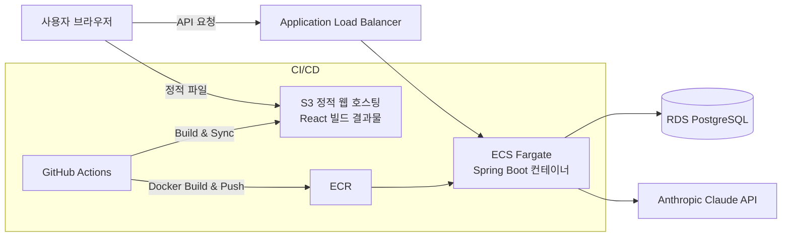

# The Untold (디 언톨드)

AI와 대화하며 사건의 진실을 추리하는 텍스트 추리 게임입니다.
플레이어는 사건 개요를 확인 후 자유롭게 질문을 던지며 AI 수사관으로부터 "예 / 아니오 / 상관없는 질문입니다" 답변을 받아 사건의 키워드를 하나씩 해금해 나갑니다. 피의게임X의 "미스터리 타임" 포맷에서 아이디어를 얻어 만들었습니다.

> 개인 포트폴리오 프로젝트로, 기획부터 백엔드/프론트엔드 개발, LLM 연동, AWS 인프라 구축 및 CI/CD 파이프라인까지 전 과정을 직접 설계하고 구현했습니다.

---

## 데모

- **플레이**: http://untold-frontend.s3-website.ap-northeast-2.amazonaws.com
- **관리자 페이지**: http://untold-frontend.s3-website.ap-northeast-2.amazonaws.com/admin  
(사건 CRUD 테스트용 비밀번호: admin_password)

---

## 주요 기능

### 플레이어

- 사건 목록 조회 및 난이도별(EASY / NORMAL / HARD) 플레이
- 자유 질문을 통한 수사
- LLM이 사건의 진실(`fullTruth`)을 기준으로 예/아니오/상관없음을 실시간 판정
- 질문 의미에 따라 키워드 자동 해금 (LLM이 의미를 판정하여 유사한 단어라면 키워드 해금)
- 키워드를 모두 찾으면 사건 종결, 전체 진실 공개
- 힌트 시스템: 10 / 20번째 질문 시 자동 공개 + 버튼 클릭으로 즉시 공개(2단계)

### 관리자

- JWT 로그인 (`/admin`)
- 사건 등록 / 목록 조회 / 수정 / 삭제 (CRUD)
- 사건별 premise(표면 스토리), fullTruth(진실), 힌트 2단계, 키워드, 난이도 관리

---

## 기술 스택

| 구분 | 사용 기술 |
|---|---|
| Backend | Java 21, Spring Boot 4.1.1, Spring Data JPA, Spring Security, JWT |
| Frontend | React 18 (Vite), React Router |
| Database | PostgreSQL 18 (Amazon RDS) |
| LLM | Anthropic Claude Haiku 4.5 API |
| 인프라 | AWS (RDS, ECR, ECS Fargate, ALB, S3, IAM) |
| CI/CD | GitHub Actions |
| 인증 | JWT (jjwt), Spring Security |

---

## 아키텍처



- **프론트엔드**: React를 정적 파일로 빌드해 S3 버킷에 호스팅
- **백엔드**: Spring Boot를 Docker 이미지로 빌드해 ECR에 저장, ECS(Fargate) 서비스에 Rolling Update 방식으로 무중단 배포
- **로드밸런서**: ALB로 고정 진입점을 확보하고, 컨테이너 재시작/재배포에도 주소가 바뀌지 않도록 구성
- **DB**: PostgreSQL RDS 사용 
- **자동 배포**: GitHub Actions로 자동 빌드·배포

---

## 폴더 구조

```
the-untold/
├── .github/workflows/         # CI/CD 파이프라인 (백엔드/프론트 개별 배포)
│   ├── deploy-backend.yml
│   └── deploy-frontend.yml
├── untold-backend/
│   ├── src/main/java/com/untold/backend/
│   │   ├── admin/             # 관리자 CRUD, JWT 인증/보안
│   │   ├── cases/             # 사건 도메인
│   │   ├── session/           # 게임 세션, 키워드 해금 기록
│   │   ├── question/          # 질문 처리, LLM 연동
│   │   └── common/            # 공통 설정, 예외 처리
│   └── Dockerfile
└── untold-frontend/
    ├── src/
    │   ├── pages/              # 화면 컴포넌트 (플레이어용 / 관리자용)
    │   ├── components/         # 재사용 컴포넌트
    │   └── api/                # 백엔드 API 호출 모듈
    └── vite.config.js
```

---

## 데이터 모델 (ERD 요약)

| 테이블 | 설명 |
|---|---|
| `cases` | 사건 정보 (제목, premise, fullTruth, 힌트 2단계, 난이도) |
| `keywords` | 사건별 정답 키워드 |
| `game_sessions` | 플레이어의 개별 게임 진행 상태 (질문 수, 해결 여부, 힌트 공개 단계) |
| `questions` | 세션별 질문/답변 기록 |
| `session_keywords` | 세션별로 해금된 키워드 (N:M 연결) |

---

## 핵심 구현 포인트

### 1. LLM 기반 질문 판정 및 키워드 해금

초기에는 질문 텍스트에 키워드 단어가 그대로 포함되어 있는지만 확인하는 단순 매칭 방식으로 구현했으나 "동료가 있었나요?" 같은 유사 표현을 인식하지 못하는 한계가 있었습니다. 이를 LLM이 한 번의 호출로 **① 예/아니오 판정과 ② 유사 의미의 키워드 매칭을 동시에 수행**하도록 개선했습니다.

```
{"answer": "예/아니오/상관없는 질문입니다 중 하나", "matchedKeywords": ["의미적으로 관련된 키워드"]}
```

프롬프트 튜닝 과정에서 다음과 같은 문제들을 발견하고 개선했습니다.

- 종결어미("~지요", "~죠")에 따라 개방형 질문으로 오판하는 문제 → 판단 기준을 어미가 아닌 "질문의 논리적 형태"로 명시
- 인물과 그 인물이 속한 조직이 혼용되는 경우(예: 교주/교단) 판정이 일관되지 않는 문제 → fullTruth 서술을 더 명확하게 재작성하고 판단 규칙 추가
- 특정 인물을 대명사("그")로 반복 지칭할 경우 질문 속 일반명사("직원")와의 동일인 여부를 연결하지 못하는 문제 → 사건 설계 단계에서 등장인물에게 고유한 이름을 부여하고, 사용자가 이름을 이용하여 질문할 수 있도록 premise에 이름 추가

### 2. 관리자 인증 (JWT)

- `/api/admin/**` 경로를 Spring Security로 보호하고, `/api/admin/login`만 예외적으로 인증 없이 허용
- 로그인 성공 시 JWT 토큰 발급, 이후 모든 관리자 API 요청에 `Authorization: Bearer {token}` 헤더로 인증
- Preflight(OPTIONS) 요청이 인증 필터에 걸려 CORS가 차단되는 문제를 겪었고 OPTIONS 메서드는 인증 체크 없이 통과하도록 처리

### 3. 배포 트러블슈팅

- **ECS 서킷 브레이커 롤백**: 태스크가 ALB와 다른 AZ에 배치되어 헬스체크에 실패하던 문제 → ECS 서비스 네트워킹 설정을 ALB가 걸쳐있는 AZ로 한정
- **S3 SPA 라우팅**: `/admin`처럼 실제 파일이 없는 경로로 직접 접근 시 404가 발생하는 문제 → 정적 웹 호스팅의 오류 문서를 `index.html`로 지정해 클라이언트 사이드 라우팅이 정상 동작하도록 처리
- **Spring Security + CORS**: Security 도입 후 기존 `WebMvcConfigurer`의 CORS 설정이 무시되는 문제 → CORS 설정을 `SecurityFilterChain` 내부로 이동

---

## 로컬 실행 방법

### 사전 준비
- Java 21, Node.js 20+, PostgreSQL, Anthropic API Key

### 백엔드

```bash
cd untold-backend
# 환경변수 설정 (DB_PASSWORD, ANTHROPIC_API_KEY, JWT_SECRET, ADMIN_PASSWORD 등)
./mvnw spring-boot:run
```

### 프론트엔드

```bash
cd untold-frontend
npm install
npm run dev
```

`.env` 파일에 `VITE_API_BASE_URL=http://localhost:8080` 설정 필요

---

## 환경 변수

| 변수명 | 설명 |
|---|---|
| `SPRING_DATASOURCE_URL` | PostgreSQL 연결 주소 |
| `DB_USERNAME` / `DB_PASSWORD` | DB 계정 정보 |
| `ANTHROPIC_API_KEY` | Claude API 키 |
| `JWT_SECRET` | JWT 서명 비밀키 |
| `ADMIN_PASSWORD` | 관리자 로그인 비밀번호 |
| `CORS_ALLOWED_ORIGIN` | 허용할 프론트엔드 origin |
| `VITE_API_BASE_URL` | (프론트) 백엔드 API 주소 |

---

## 향후 개선 계획

- [ ] pgvector 기반 임베딩 유사도 검색으로 키워드 판정 고도화
- [ ] 사건 목록 페이지네이션
- [ ] 방문 통계, 세션 로그 등 관리자 대시보드
- [ ] 사용자 계정 및 랭킹 시스템
- [ ] CloudFront 도입으로 HTTPS 적용 및 S3 라우팅 이슈 해소

